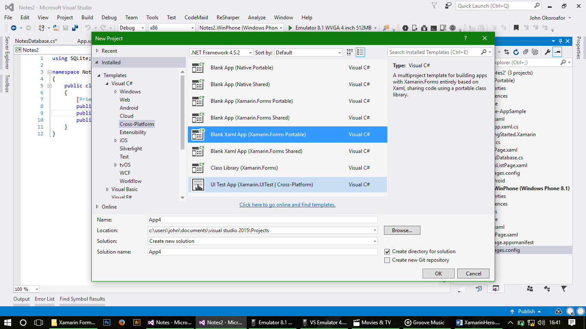
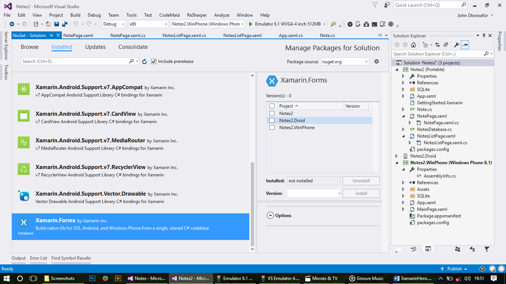
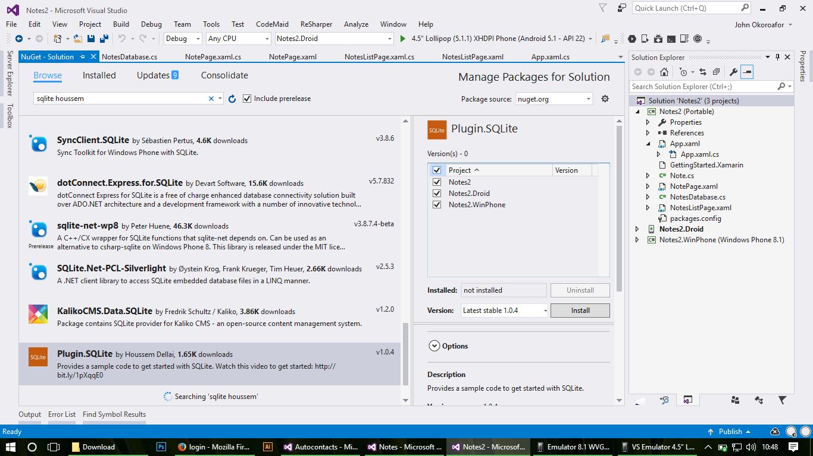
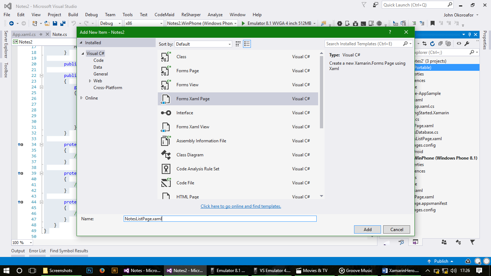
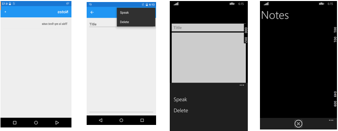

In this sample we Create a simple Note taking app on Android and windows phone 8 which would utilize and introduce us to plugins in Xamarin.Forms: the Speak plugin (for text to speech), and SQLite plugin (for saving data to a local database on the phone. Let’s get Started.
1.	Create a new Xamarin.Forms PCL Project
File >> New>> Project>> Crossplartform>> Blank Xaml App (Xamarin Forms Portable)
 
 

You may delete other projects we won’t be using. First things first, setup our projects and get the necessary plugins. 
2.	Right click on the Solution and Manage Nuget Packages. In the update tab, update the amarin.Forms Nuget package. ONLY THE XAMARIN.FORMS NUGET PACKAGE. 
Tools >> Nugget packet Manager>> Manage Nugget packet Manager for Solution
Click on Updates the select Xamarin.Forms and Update
 
  
  
  
3.	Browse and search for the text to speech plugin by James Montemagno called Xam.Plugins.TextToSpeech, install in all projects.
Tools >> Nugget packet Manager>> Manage Nugget packet Manager for Solution
Click on Browse

 
 
 
 
4.when it’s completed, search for Plugin.SQLite by Houssem Dellai and repeat the same installation process done on step 3 step .
 
 
 
 
Now that’s done, you may notice extra folders in your projects called SQlites, no worries, they were trying to Help. In your PCL, delete the folder titled “SQLite-Appsample” and its contents
To delete  you click on the folder and right click and select the delete option. Setup windows phone for SQLite by opening the windows phone project folder, right click on reference and add reference, under the windows phone 8.1 tab select extensions and tick “Microsoft visual c++ 2013” and OK it.
*** 
When that’s done roll up your sleeves and let’s get dirty, ahem, I meant to work. Let’s get to work.
Everything we are going to be doing would be in our  {App Nam} ( Portable ) folder at the top left of your Visual studio  folder. 
5.Create a class and call it Note.cs, this would be our Note model class and replace the code.

Right Click on your App Portable Project folder {app name} (Portable) click on the Add Option, click on class.cs then rename the file to Note.Cs
Replace the code below with the code in the file

using SQLite;
namespace Notes
{
    public class Note
    {
        [PrimaryKey, AutoIncrement]
        public int Id { get; set; }
        public string Name { get; set; }
        public string Details { get; set; }
    }
}

fix namespace errors. (Note on the 5th Line “ public class Note “ Change Note to your App Name

6.Now that’s done we need to setup our database. Create a new Class and call it {yourappname}Database.cs and replace the code
Import using statements and fix namespace errors.

using SQLite;
using System.Collections.Generic;
using System.Linq;
using Xamarin.Forms;
using XamarinForms.SQLite.SQLite;

namespace Notes
{
    public class NotesDatabase
    {
        private readonly SQLiteConnection database;

        public NotesDatabase()
        {
            database = DependencyService.Get<ISQLite>().GetConnection();
            database.CreateTable<Note>();
        }

        public List<Notes> GetItems()
        {
            return database.Table<Notes>().ToList();
        }

        public Note GetItem(int id)
        {
            return database.Table<Notes>().FirstOrDefault(i => i.Id == id);
        }

        public int SaveItemAsync(Notes item)
        {
            if (item.Id != 0)
            {
                return database.Update(item);
            }
            else
            {
                return database.Insert(item);
            }
        }

        public int DeleteItemAsync(Notes item)
        {
            return database.Delete(item);
        }
    }
}
This class will setup and handle our CRUD (CRUD is an acronym for the four basic types of SQL commands: Create , Read , Update , Delete ) operations in our database.

7.When that’s done Open the App.xaml.cs file and make it look like this:
Click on the right facing arrow on App.xaml it would displace the App.xaml.cs file click on it 

using System;
using System.Collections.Generic;
using System.Linq;
using System.Text;

using Xamarin.Forms;
using XamarinForms.SQLite;

namespace Notes2
{
    public partial class App : Application
    {
        public static NotesDatabase database;
        public App()
        {
            InitializeComponent();
            MainPage = new NavigationPage(new NotesListPage());
        }

        public int ResumeAtNoteId { get; set; }

        public static NotesDatabase Database
        {
            get
            {
                if (database == null)
                {
                    database = new NotesDatabase();
                }
                return database;
            }
        }

        protected override void OnStart()
        {
            // Handle when your app starts
        }

        protected override void OnSleep()
        {
            // Handle when your app sleeps
        }

        protected override void OnResume()
        {
            // Handle when your app resumes
        }
    }
}

This would create a static instance of our database to utilize throughout our application. You may get an error in the MainPage area. No worries, let’s go create the pages.

8.Add a new xaml page and name it NotesListPage.xaml
Add >> new item >>forms Xaml Page  rename  NotesListPage.xaml

 
 

 Add the Listview and define its template in your xaml:
 
<ContentPage.ToolbarItems>
    <ToolbarItem Text="+" 
                 Clicked="AddItem">
    </ToolbarItem>
  </ContentPage.ToolbarItems>

  <ListView x:Name="ListView" Margin="10" ItemSelected="OnListItemSelected">
    <ListView.ItemTemplate>
      <DataTemplate>
        <ViewCell>
          <StackLayout Margin="10,0,0,0"
                       Orientation="Horizontal"
                       HorizontalOptions="FillAndExpand">
            <Label Text="{Binding Name}"
                   FontAttributes="Bold"
                   VerticalTextAlignment="Center"
                   HorizontalOptions="StartAndExpand" />
          </StackLayout>
        </ViewCell>
      </DataTemplate>
    </ListView.ItemTemplate>
  </ListView>
Check to fix any impending errors that may arise. We have defined our Listview and given it its data template which comprise a stacklayout and a label to display text.

9. In the code behind, NotelistPage.xaml.cs adjust the code to look like this:

using System;
using System.Collections.Generic;
using System.Linq;
using System.Text;
using System.Threading.Tasks;
using Xamarin.Forms;

namespace Notes
{
    public partial class NotesListPage : ContentPage
    {
        public NotesListPage()
        {
            InitializeComponent();
        }

         protected override void OnAppearing()
         {
             base.OnAppearing();
 
             // Reset the 'resume' id, since we just want to re-start here
             ((App)Application.Current).ResumeAtNoteId = -1;
             ListView.ItemsSource = App.Database.GetItems();
         }

        async void AddItem(object sender, EventArgs e)
        {
	// Navigate to the next page passing the binding context
            await Navigation.PushAsync(new NotePage()
            {
                BindingContext = new Note()
            });
        }

        async void OnListItemSelected(object sender, SelectedItemChangedEventArgs e)
        {
            var note = (Note) e.SelectedItem;
            if (note != null)
                ((App) Application.Current).ResumeAtNoteId = note.Id;
            await Navigation.PushAsync(new NotePage
            {
                BindingContext = (Note) e.SelectedItem
            });
        }
    }
}

Again remember to fix namespace errors if they come up.

10.Now we are done with the landing page which shows our lists of notes with a ‘+’ button on the toolbar to add a new note, let’s go ahead and create a page which would serve as a note editor. Create a new xaml page name NotePage.xaml and adjust the code:

<?xml version="1.0" encoding="utf-8"?>
<ContentPage xmlns="http://xamarin.com/schemas/2014/forms"
             xmlns:x="http://schemas.microsoft.com/winfx/2009/xaml"
             x:Class="Notes.NotePage"
             Title="{Binding Name}">

  <ContentPage.ToolbarItems>
    <ToolbarItem Text="Speak"
                 Priority="0"
                 Order="Secondary"
                 Clicked="OnSpeakClicked" />
    <ToolbarItem Text="Delete"
                 Priority="1"
                 Order="Secondary"
                 Clicked="OnDeleteClicked" />
  </ContentPage.ToolbarItems>

  <StackLayout VerticalOptions="FillAndExpand" HorizontalOptions="FillAndExpand" Padding="10">
    <Entry Placeholder="Title"
           Text="{Binding Name}"
           FontAttributes="Bold"
           TextChanged="TextEntered"
           VerticalOptions="Start" />
    <Editor TextChanged="TextEntered"
            Text="{Binding Details}"
            VerticalOptions="FillAndExpand" />
  </StackLayout>
</ContentPage>

11. This creates a new page with and entry and an editor control to input text: Title of note and Note Details with a toolbar options menu containing the speak and delete items. Let’s go over to the code behind to add functionality to the page.

using System;
using System.Collections.Generic;
using System.Linq;
using System.Text;
using System.Threading.Tasks;
using Plugin.TextToSpeech;
using Xamarin.Forms;

namespace Notes
{
    public partial class NotePage : ContentPage
    {
        public NotePage()
        {
            InitializeComponent();
        }

        async void OnDeleteClicked(object sender, EventArgs e)
        {
            var note = (Note)BindingContext;
            App.Database.DeleteItemAsync(note);
            await Navigation.PopAsync();
        }

        void OnSpeakClicked(object sender, EventArgs e)
        {
            var note = (Note)BindingContext;
            CrossTextToSpeech.Current.Speak($"{note.Name} {note.Details}");
        }

         void TextEntered(object sender, EventArgs e)
        {
            var note = (Note)BindingContext;
            App.Database.SaveItemAsync(note);
        }

    }
}

Now all things working fine and running select your start up project from the toolbar and run. It may take a while on first run, just on first run, so be patient and grab a snack. It should look like this all things going well. If not get help from an instructor.

 
