<a name="HOLTitle"></a>
# Azure Web Apps #

---

<a name="Overview"></a>
## Overview ##

[Azure App Service](https://azure.microsoft.com/en-us/documentation/articles/app-service-value-prop-what-is/) is a set of services provided by Microsoft Azure to enable developers to easily build and deploy Web apps and mobile apps for various platforms and devices. Included in the App Service family are [Azure Web Apps](https://azure.microsoft.com/en-us/documentation/articles/app-service-web-overview/), which allow you to quickly and easily deploy Web sites built with tools and languages you’re already familiar with; [Azure Mobile Apps](https://azure.microsoft.com/en-us/documentation/articles/app-service-mobile-value-prop/), which provide data services, syncing services, notification services, and other back-end services for popular mobile operating systems; [Azure API Apps](https://azure.microsoft.com/en-us/documentation/articles/app-service-api-apps-why-best-platform/), which simplify the writing, publishing, and consuming of cloud APIs; and [Azure Logic Apps](https://azure.microsoft.com/en-us/documentation/articles/app-service-logic-what-are-logic-apps/), which are great for automating business processes.

Azure Web Apps makes deploying Web sites extraordinarily easy – and not just Web sites built using the Microsoft stack. You can deploy PHP apps that use MySQL just as easily as ASP.NET apps that use SQL Server. You can select from a wide variety of Web App templates or build templates of your own. You can configure Web Apps to auto-scale as traffic increases to ensure that your customers aren’t left waiting during periods of peak demand. You can publish apps to pre-production staging locations and test them in the cloud before taking them live, and then swap staging deployments for production deployments with the click of a button. You can even create WebJobs – programs or scripts that run continuously or on a schedule to handle billing and other time-critical tasks. In short, Azure Web Apps takes the pain out of publishing and maintaining Web apps and are just as suitable for a personal photo-sharing site as they are for enterprise-grade sites serving millions of customers.

In this lab, you will use the cross-platform [Visual Studio Code](https://code.visualstudio.com/)  editor to build a Web site . The site will just show random text. You will then provision a new Azure Web App to host the site. Finally, you will upload the site's content to the newly provisioned Web App and view it in your browser.

<a name="Objectives"></a>
### Objectives ###

In this hands-on lab, you will learn how to:

- Use Visual Studio Code to build a  Web site
- Provision an Azure Web App to host the Web site
- Deploy the Web site using FTP

<a name="Prerequisites"></a>
### Prerequisites ###

The following are required to complete this hands-on lab:

- An active Microsoft Azure subscription. Use the one you created in Lab 1, or [sign up for a free trial](http://aka.ms/WATK-FreeTrial)
- [Visual Studio Code](https://code.visualstudio.com/download)
- [PHP for Windows](http://windows.php.net/download/)

---
<a name="Exercises"></a>
## Exercises ##

This hands-on lab includes the following exercises:

- [Exercise 1: Build a Web site with Visual Studio Code](#Exercise1)
- [Exercise 2: Provision a MySQL Web App](#Exercise2)
- [Exercise 3: Deploy the Web site](#Exercise3)

Estimated time to complete this lab: **45** minutes.

<a name="Exercise1"></a>
## Exercise 1: Build a Web site with Visual Studio Code

In this exercise, you will use [Visual Studio Code](https://code.visualstudio.com/) to build a Web site. Visual Studio Code is a free, cross-platform code editor available for Windows, macOS, and Linux that supports a variety of programming languages, both natively and via extensions. It also features built-in Git support as well as syntax highlighting and code completion via [IntelliSense](https://code.visualstudio.com/#meet-intellisense).

1. Start Visual Studio Code.  Open the **File** menu and select **Open Folder**.

    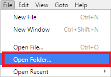

    _Starting the project_
    
1. In the Select Folder dialog, choose a suitable folder for your Web site's code. Then click the **Select Folder** button.

    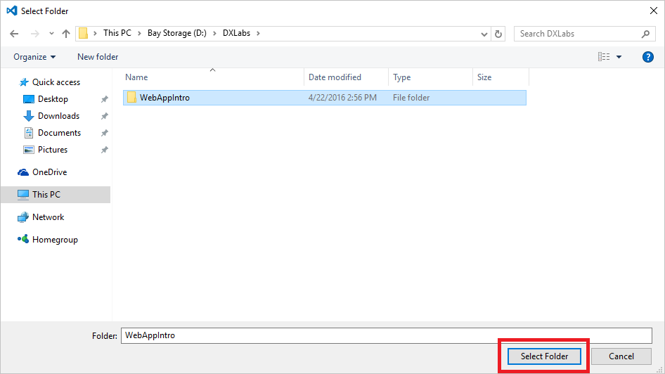

    _Selecting a project folder_
    
1. From the **File** menu, select **New File**.

    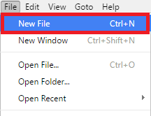

    _Adding a file to the project_
    
1. Add the following code and markup to the new file to serve as the main page for your Web site:
    
    ```html
   <!DOCTYPE html>
<html >
<head>
  <meta charset="UTF-8">
  <title>Xamarin Unplugged Port harcourt</title>
  
  
  
      <link rel="stylesheet" href="css/style.css">

  
</head>

<body>
  <div id="slogan" data-text="Xamarin is stronger"></div>
  <script src='https://cdnjs.cloudflare.com/ajax/libs/jquery/3.1.0/jquery.min.js'></script>

    <script src="js/index.js"></script>

</body>
</html>

    ```

1. Use the **File -> Save** command to save the file. Name it **index.html**.

    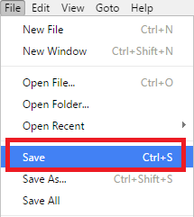

    _Saving the file_
    
1. Repeat Steps 3 through 5 to add a file named **index.js** containing the following code to the project. This is the code that returns images requested by the browser over HTTP.

    ```js
   (function($){

    $.fn.typer = function(options){

        var defaults = $.extend({
            search: '',
            replace: [],
            speed: 50,
            delay: 2000
        }, options);
        
        var bintext = function(length){
            var text = '';
            for(var $i = 0; $i<=length;$i++) {
                text = text + Math.floor(Math.random() * 2)
            }
            return text;
        };

        this.each(function(){

            var $this = $(this);
            var $text = $this.data('text');
            var position = 0;

            var indexOf = $text.indexOf( defaults.search );
            var normal = $text.substr(0, indexOf);
            var changer = $text.substr(indexOf, $text.length);

            defaults.replace.push(changer);

            var interval = setInterval(function(){
                var $bintext = '';

                if( position == indexOf ) {

                    $bintext = bintext(changer.length-1);

                    $this.html( $text.substr(0, normal.length) );
                    $this.append('<span>' + $bintext + '</span>')

                } else if( position > indexOf ) {


                    $bintext = bintext($text.length-1);

                    $this.delay(defaults.speed).find('span').html(
                        changer.substring(0, position - indexOf) +
                        $bintext.substring(position, ($bintext.length))
                    );

                } else if( position < indexOf ) {

                    $bintext = bintext($text.length-1);

                    $this.delay(defaults.speed).html(
                        normal.substring(0, position) +
                        $bintext.substring(position, ($bintext.length))
                    );

                }

                if( position < $text.length ) {
                    position++;
                } else {
                    clearInterval(interval);

                    var index = 0;
                    setInterval(function(){

                        var position = 0;
                        var newText = defaults.replace[index];

                        var changeInterval = setInterval(function(){

                            var $bintext = '';
                            for(var $i = 0; $i<=newText.length-1;$i++) {
                                $bintext = $bintext + Math.floor(Math.random() * 2)
                            }

                            $this.delay(defaults.speed).find('span').html(
                                newText.substring(0, position) +
                                $bintext.substring(position, ($bintext.length))
                            );

                            if( position < $text.length ) {
                                position++;
                            } else {
                                clearInterval(changeInterval);
                            }

                        }, defaults.speed);

                        if( index < defaults.replace.length-1 ) {
                            index++;
                        } else {
                            index = 0;
                        }
                    }, defaults.delay)


                }
            }, defaults.speed)

        });

    }


})(jQuery)

$(function(){
  $('#slogan').typer({
    search: 'stronger',
    replace: ['powerful', 'easiest', 'better']
  })
})
    ```

1. Repeat Steps 3 through 5 to add a file named **images.php** containing the following code to the project. This is the code used to upload, store, and retrieve images.

    ```css
    body {
            margin: 0;
            padding: 0;
            font-family: monospace;
            background: url('https://wallpapers.wallhaven.cc/wallpapers/full/wallhaven-449086.jpg') #000 no-repeat;
            background-size: 100%;
        }
        #slogan {
            text-align: center;
            font-size: 36px;
            margin-top: 20%;
            color: #fff;
        }
        #slogan span { color: #ff0 }
        #slogan span.selected {
            background: #09f;
            color: #fff;
        }
    ```


That's it! your Web site is built. The next step is to provision an Azure Web App to host it.

<a name="Exercise2"></a>
## Exercise 2: Provision a Web App

There are several ways to provision an Azure Web App. In this exercise, you will use the Azure Portal to do it. Provisioning is quick and easy and involves little more than answering a few questions and clicking a few buttons. Once the Web App is provisioned, you can navigate to it in your browser just as you would any other Web site.

1. Open the [Azure Portal](https://portal.azure.com) in your browser. If you are asked to log in, do so using your Microsoft account.

1. Click **+ New**. In the "New" blade that opens, type the words "web app mysql" (without quotation marks) into the search box and press **Enter**.

    

    _Finding the "Web App + Mobile" template_

1. Two new blades named "Marketplace" and "Everything" open in the portal. The former represents the [Microsoft Azure Marketplace](https://azure.microsoft.com/en-us/marketplace/), which is an online store containing thousands of free templates for deploying apps, services, virtual machines, and more, preconfigured for Azure and provisioned with popular tools such as WordPress, CakePHP, and Django. In the "Everything" blade, click **Web App + Mobile**.

    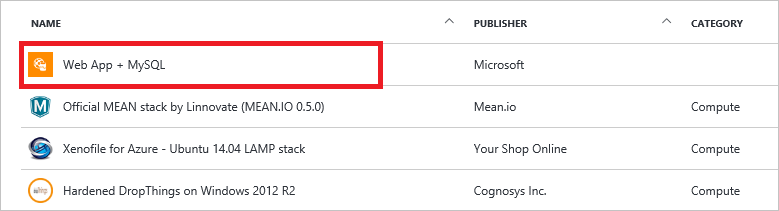

    _Selecting the "Web App + M" template_
    
1. In the "Web App + MySQL" blade that opens, take a moment to review the text and learn what the template provisions. Then click the **Create** button at the bottom of the blade.

    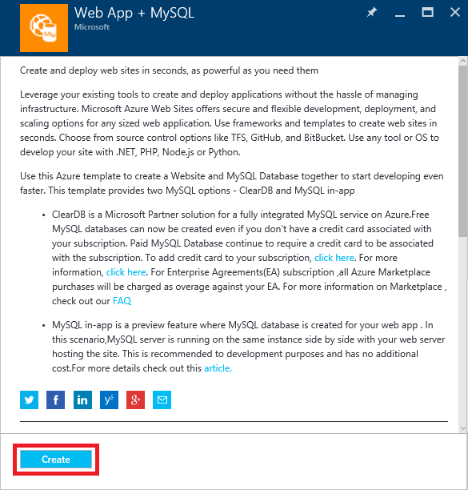

    _Creating a Web App with MySQL_

1. Enter a name for your Web app in the **App name** field. *This name must be unique within Azure, so make sure a green check mark appears next to it*. Select **Create new** under **Resource Group** and enter the resource-group name "WebAppsLabResourceGroup" (without quotation marks). Then select **ClearDB** as the **Database Provider**.

	> Resource groups are a powerful construct for grouping resources such as storage accounts, databases, and virtual machines together so they can be managed as a unit. Deleting a resource group deletes everything inside it and prevents you from having to delete those resources one by one.

   
    
1. Once the Web App has been created (it usually takes about one minute), click the tile that was created for it on the dashboard.

1. Click the Web site URL to browse to the placeholder page for your new Web site. 

    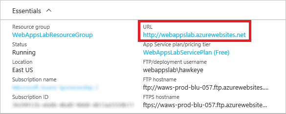

    _The Web site URL_

1. Confirm that the placeholder page appears. Then close the browser window or tab in which it opened and return to the Azure Portal.

    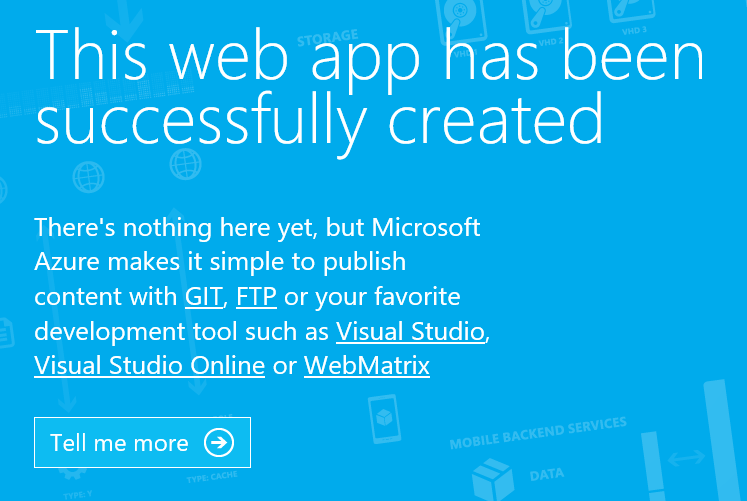

    _The Web site's temporary home page_


<a name="Exercise3"></a>
## Exercise 3: Deploy the Web site

Now it is time to copy the files that comprise your Web site to the Azure Web App. In this exercise, you will publish your Web site using FTP.

1. Click **Deployment credentials** in the blade for the Web app.
 
    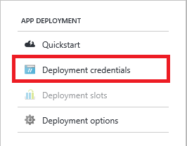

    _Viewing deployment credentials_

1. Enter a user name and password for connecting to your site via FTP. **Be sure to remember the password**. Click the **Save** button at the top of the blade to save these credentials.

    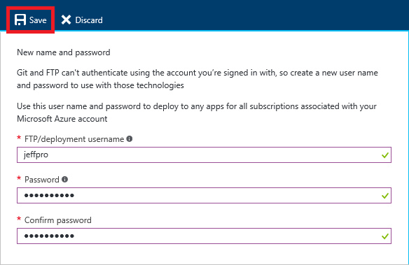

    _Specifying FTP credentials_

1. Click **Overview** in the blade for the Web app.

    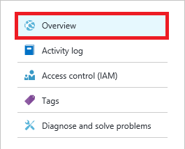

    _Specifying FTP credentials_

1. Locate the **FTP/Deployment username** and **FTP hostname** values. Hover the mouse cursor over the FTP hostname and click the **Copy** button that appears on the right to copy the hostname to the clipboard.
  
    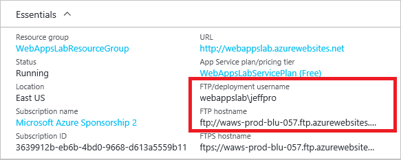

    _The FTP username and hostname_

1. Open a Windows File Explorer window and paste the FTP hostname value into the address box at the top of the window. Then press **Enter**.
     
    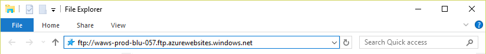

    _Entering the FTP hostname in File Explorer_
     
1. When prompted to enter FTP credentials, enter the FTP username (the **FTP/deployment username** in Step 4) and the password you specified in Step 2. Then click **Log On**.

    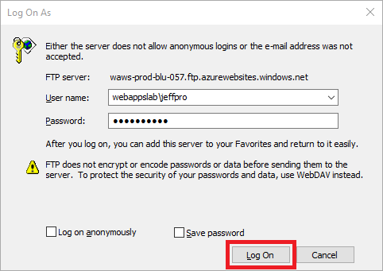
    
    _Entering your FTP credentials_

1. Double-click the **site** folder in the File Explorer window.

    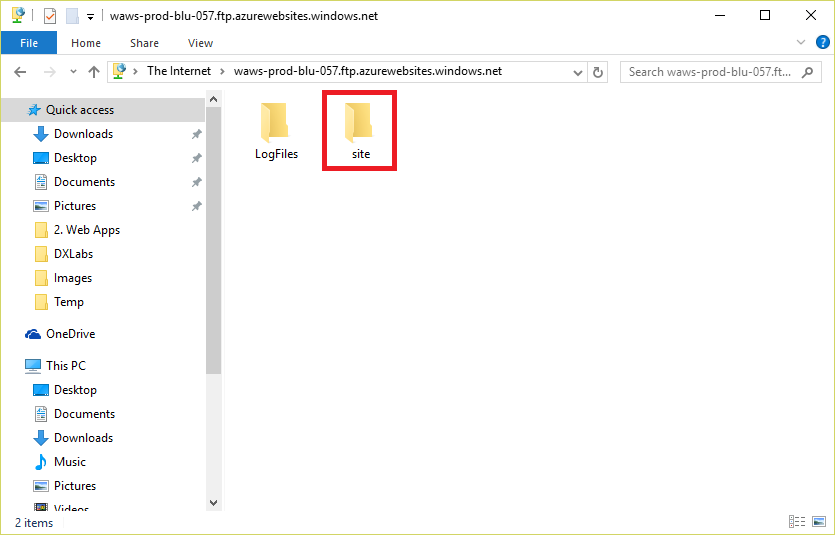
    
    _Opening the site folder_

1. Double-click the **wwwroot** folder in the File Explorer window. This is the root folder for your Web site.

    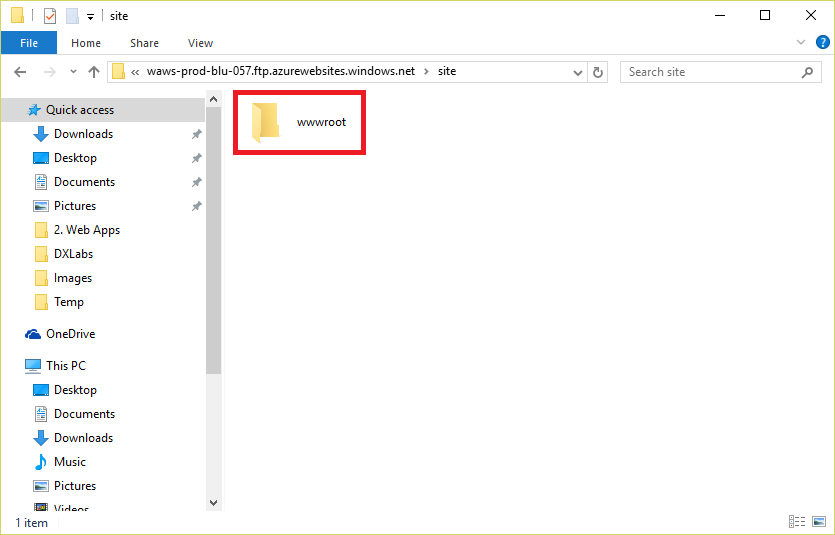
    
    _Opening the wwwroot folder_

1. Delete the **hostingstart.html** file. This is the placeholder page you saw earlier when you connected to the site in your browser. When prompted to confirm the deletion, select **Yes**.
    
1. Open another File Explorer window and navigate to the folder containing the Web site files you created in [Exercise 1](#Exercise1).
    
1. Copy all of the files and folders that comprise the Web site to your site's **wwwroot** folder.  
       
    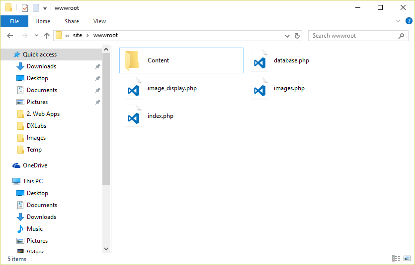

    _Copying the web site files_

1. Congratulations! You now have a working Web site. Click the site URL in the Azure Portal to open the site in your browser.

    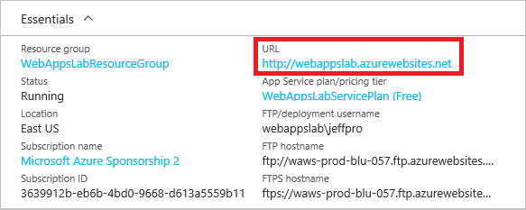

    _Navigating to the finished Web site_

1. Upload a few images to the Web site. Click any of the image thumbnails to see an enlarged view.

	> By default, the PHP installation in your Azure Web App limits file uploads to 8 MB. You can increase the limit by adding a .user.ini file to your site as [described here](https://azure.microsoft.com/en-us/documentation/articles/web-sites-php-configure/). For now, just upload images that are smaller than 8 MB because you would have to adjust other PHP settings such as MEMORY_LIMIT to handle very large images.
    
    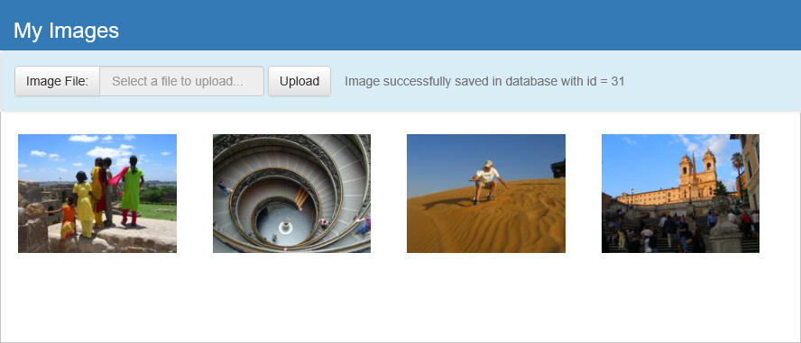

    _The working Web site_

## Summary

In this hands-on lab, you learned how to:

- Use Visual Studio Code to build a Web site
- Provision an Azure Web App
- Upload a Web site to Azure

Azure Web Apps allows you to use the tools and languages you already know to build great Web sites and publish them to the Web. You can focus on what you know and what you want to accomplish rather than spend time maintaining physical infrastructure, installing security updates, and learning new languages. Moreover, Azure Web Apps can easily leverage other features of the Azure ecosystem such as Azure Storage, Azure Search, and Azure Cognitive Services to achieve unprecedented scale and richness. Which, as it happens, is the subject of the next lab.

----

Copyright 2016 Microsoft Corporation. All rights reserved. Except where otherwise noted, these materials are licensed under the terms of the MIT License. You may use them according to the license as is most appropriate for your project. The terms of this license can be found at https://opensource.org/licenses/MIT.
